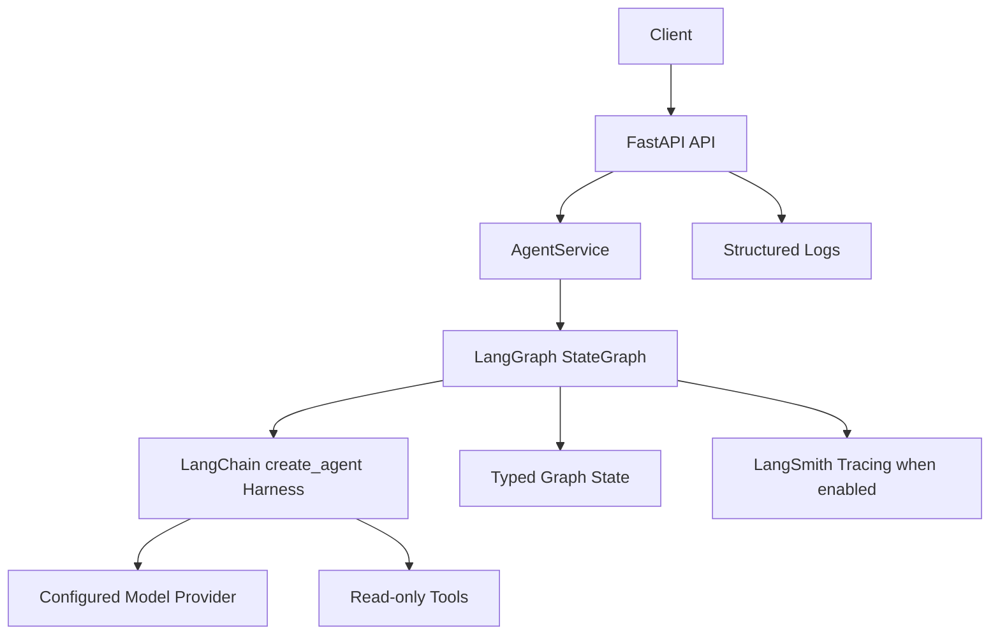
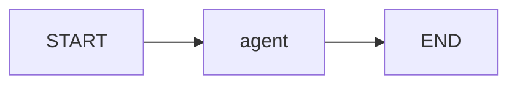

# Architecture

## Problem

Provide a maintainable AI agent application baseline that can be run locally, tested without provider credentials, and deployed through LangGraph-compatible infrastructure.

## Requirements

- LangChain/LangGraph agent orchestration.
- Typed request/response and graph state schemas.
- Centralized environment configuration.
- Bounded tool surface with explicit safety model.
- Structured logs and request/thread correlation.
- CI-ready linting, typing, tests, and security scanning.

## System Diagram

## Graph Flow

The graph is intentionally simple. It uses LangGraph for explicit state and deployment compatibility, while LangChain's agent harness owns the model/tool loop.

## Component Responsibilities

- `api/`: HTTP transport, health endpoints, HTTP error mapping.
- `services/`: application use cases and request normalization.
- `graphs/`: LangGraph construction and node behavior.
- `agents/`: high-level agent composition and approved tool wiring.
- `models/`: LangChain `create_agent` boundary and provider configuration.
- `tools/`: bounded tool implementations.
- `state/`: graph state type definitions.
- `schemas/`: public API and structured output contracts.
- `security/`: input, URL, and tool policy checks.
- `observability/`: structured logging setup.
- `prompts/`: versionable prompt assets.

## State Model

`MainGraphState` contains message history, request ID, thread ID, optional hashed user ID, answer, and error fields. User IDs are hashed before entering telemetry-oriented state.

## Persistence

Local direct invocation does not configure a production checkpointer. For LangGraph Agent Server deployment, persistence is managed by Agent Server. Long-term memory and domain persistence are not implemented because there is no product requirement yet.

## Security Boundaries

The model is not trusted as a security boundary. Tool availability is enforced in application code. Current tools are read-only and bounded. External URLs are rejected if they target local hosts.

## Observability

Logs are JSON-formatted through `structlog` and include service, version, environment, request ID, and thread ID where available. LangSmith tracing can be enabled through environment variables.

## Scaling

The service is stateless except for provider clients and graph construction. Horizontal scaling is supported for the HTTP layer. Durable thread state requires Agent Server managed persistence or a configured production checkpointer.

## Failure Handling

Expected failures are classified through `AppError` subclasses. Tool validation errors are caller-visible. Model execution failures are retryable and alert-worthy. Health endpoints do not perform LLM calls.
