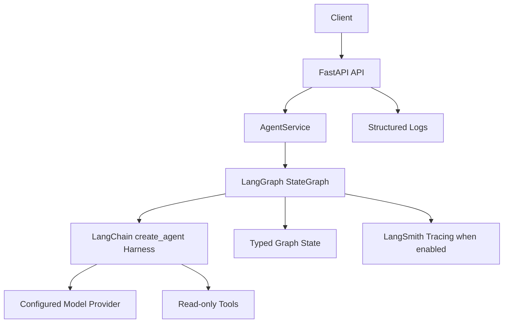
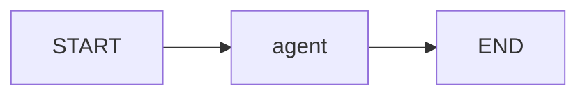

# Architecture

## Problem

Provide a maintainable AI agent application baseline that can be run locally, tested without provider credentials, and deployed through LangGraph-compatible infrastructure.

## Requirements

- LangChain/LangGraph agent orchestration.
- Typed request/response and graph state schemas.
- Centralized environment configuration.
- Bounded tool surface with explicit safety model.
- Structured logs and request/thread correlation.
- CI-ready linting, typing, tests, and security scanning.

## System Diagram

## Graph Flow

The graph is intentionally simple. It uses LangGraph for explicit state and deployment compatibility, while LangChain's agent harness owns the model/tool loop.

## Component Responsibilities

- `api/`: HTTP transport, health endpoints, HTTP error mapping.
- `services/`: application use cases and request normalization.
- `graphs/`: LangGraph construction and node behavior.
- `agents/`: high-level agent composition and approved tool wiring.
- `models/`: LangChain `create_agent` boundary, provider configuration, and provider/harness exception classification.
- `tools/`: bounded tool implementations.
- `state/`: graph state type definitions.
- `schemas/`: public API and structured output contracts.
- `security/`: input, URL, and tool policy checks.
- `observability/`: structured logging setup.
- `prompts/`: versionable prompt assets.
- `errors/`: shared `AppError` taxonomy and HTTP/retry/visibility metadata.

## State Model

`MainGraphState` contains message history, request ID, thread ID, optional hashed user ID, answer, and error fields. User IDs are hashed before entering telemetry-oriented state.

## Persistence

Local direct invocation does not configure a production checkpointer. For LangGraph Agent Server deployment, persistence is managed by Agent Server. Long-term memory and domain persistence are not implemented because there is no product requirement yet.

## Security Boundaries

The model is not trusted as a security boundary. Tool availability is enforced in application code. Current tools are read-only and bounded. External URLs are rejected if they target local hosts.

## Observability

Logs are JSON-formatted through `structlog` and include service, version, environment, request ID, and thread ID where available. LangSmith tracing can be enabled through environment variables.

## Scaling

The service is stateless except for provider clients and graph construction. Horizontal scaling is supported for the HTTP layer. Durable thread state requires Agent Server managed persistence or a configured production checkpointer.

## Failure Handling

Expected failures are classified through `AppError` subclasses (`src/neuron_agent/errors/base.py`), each carrying an `ErrorContext(code, http_status, retryable, user_visible, alert)`:

| Exception | Code | HTTP | Retryable | Client sees reason |
| --- | --- | --- | --- | --- |
| `ValidationAppError` | `validation_error` | 400 | no | yes |
| `AuthorizationError` | `authorization_error` | 403 | no | yes |
| `RateLimitError` | `rate_limit_error` | 429 | yes | yes |
| `ProviderTimeoutError` | `provider_timeout_error` | 504 | yes | yes |
| `ConfigurationError` | `configuration_error` | 500 | no | no |
| `ProviderError` | `provider_error` | 502 | yes | no |
| `ToolExecutionError` | `tool_execution_error` | 502 | yes | no |
| `StructuredOutputError` | `structured_output_error` | 502 | yes | no |
| `AgentExecutionError` | `agent_execution_error` | 500 | yes | no |

`api/main.py` centralizes the HTTP mapping: it raises `HTTPException(status_code=exc.context.http_status, detail=...)`, where `detail` is the stable `code` when `user_visible` is `True`, or the generic `internal_server_error` otherwise — so provider/tool/internal failure detail never reaches the client, only the server logs (via `logger.warning`/`logger.exception`). Any exception that isn't an `AppError` also maps to a generic `500 internal_server_error`.

`graphs/main_graph.py::call_agent` classifies failures from the agent loop by underlying exception type: `openai.RateLimitError` → `RateLimitError`, `openai.APITimeoutError` → `ProviderTimeoutError`, `openai.AuthenticationError` → `ConfigurationError`, any other `openai.OpenAIError` → `ProviderError`, `langchain`'s structured-output errors → `StructuredOutputError`, and anything else (including a LangGraph recursion-limit error) falls back to `AgentExecutionError`. `models/factory.py` raises `ConfigurationError` for an unsupported model provider or a malformed `provider:model` identifier. Health endpoints do not perform LLM calls.

Every tool call is bounded by `APP_TOOL_TIMEOUT_SECONDS` via a `wrap_tool_call` agent middleware (`models/factory.py::tool_timeout_middleware`); a tool that exceeds it raises `ToolExecutionError` directly, which `classify_agent_error` now passes through unchanged instead of reclassifying.

An outer `wrap_tool_call` middleware (`models/factory.py::tool_failure_isolation_middleware`) wraps every tool call — including timeouts from the middleware above — to log invocation metadata safely (`tool_name`, `duration_ms`, `error_code`; never raw arguments or exception text) and to isolate failures: an `AppError` (e.g. the calculator's `ValidationAppError` for invalid input) passes through unchanged, while any other exception is reclassified as `ToolExecutionError` so a tool bug can never surface an unclassified error or crash the agent loop. `calculator` additionally rejects expressions over 200 characters as `ValidationAppError` before parsing, bounding recursion depth during AST parsing/evaluation.

Model calls are retried up to `APP_PROVIDER_MAX_RETRIES` times via a `wrap_model_call` agent middleware (`models/factory.py::provider_retry_middleware`, built on `langchain`'s `ModelRetryMiddleware`) with exponential backoff and jitter; only transient provider failures (`openai.APIConnectionError`, `APITimeoutError`, `RateLimitError`, `InternalServerError`) are retried — anything else (auth, malformed requests, unrecognized errors) propagates immediately. The OpenAI SDK's own client-level retries are disabled (`max_retries=0` on `ChatOpenAI`) so this middleware is the single, centralized retry policy. Each attempt still respects `APP_REQUEST_TIMEOUT_SECONDS`; retries are not wrapped in an additional aggregate timeout.
