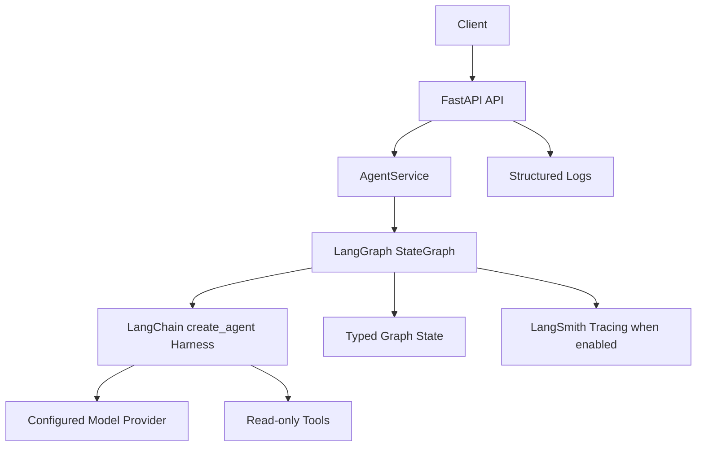

# Architecture

## Problem

Provide a maintainable AI agent application baseline that can be run locally, tested without provider credentials, and deployed through LangGraph-compatible infrastructure.

## Requirements

- LangChain/LangGraph agent orchestration.
- Typed request/response and graph state schemas.
- Centralized environment configuration.
- Bounded tool surface with explicit safety model.
- Structured logs and request/thread correlation.
- CI-ready linting, typing, tests, and security scanning.

## System Diagram

```mermaid
flowchart TD
    Client[Client] --> API[FastAPI API]
    API --> Service[AgentService]
    Service --> Graph[LangGraph StateGraph]
    Graph --> Agent[LangChain create_agent Harness]
    Agent --> Model[Configured Model Provider]
    Agent --> Tools[Read-only Tools]
    Graph --> State[Typed Graph State]
    API --> Logs[Structured Logs]
    Graph --> LangSmith[LangSmith Tracing when enabled]
```

## Graph Flow

```mermaid
flowchart LR
    START --> AgentNode[agent]
    AgentNode --> END
```

The graph is intentionally simple. It uses LangGraph for explicit state and deployment compatibility, while LangChain's agent harness owns the model/tool loop.

## Component Responsibilities

- `api/`: HTTP transport, health endpoints, HTTP error mapping.
- `services/`: application use cases and request normalization.
- `graphs/`: LangGraph construction and node behavior.
- `agents/`: high-level agent composition and approved tool wiring.
- `models/`: LangChain `create_agent` boundary, provider configuration, and provider/harness exception classification.
- `tools/`: bounded tool implementations.
- `state/`: graph state type definitions.
- `persistence/`: checkpointer construction and lifecycle (`APP_CHECKPOINTER`), plus the `setup` operator command.
- `schemas/`: public API and structured output contracts.
- `security/`: input, URL, and tool policy checks.
- `observability/`: structured logging setup.
- `prompts/`: versionable prompt assets.
- `errors/`: shared `AppError` taxonomy and HTTP/retry/visibility metadata.

## State Model

`MainGraphState` contains:
- message history (`messages`), the thread's persisted conversation;
- per-run fields, overwritten every turn: request ID, run ID, `user_message`, answer, and error;
- the thread ID;
- the optional hashed user ID, which also records the thread's owner.

User IDs are hashed before entering telemetry-oriented state.

A turn is committed atomically (ADR 0005). `AgentService` passes the new user text as `user_message` with an empty `messages` input. The `agent` node sends `history + HumanMessage(user_message)` to the agent and, only on success, appends that `HumanMessage` and the final `AIMessage` to `messages` while clearing `user_message`. A failed run leaves `messages` unchanged. Its `user_message` does remain in that run's checkpoint until the next turn overwrites it. History is only ever read from `messages`, so the stale value is never replayed. Like every turn's input, it is part of the stored checkpoint history, which is user data removed by thread deletion and retention (ADR 0005, decision 7). The agent's intermediate tool-call and tool-result messages are not persisted. Inputs that already carry the user turn in `messages`, as Agent Server and LangGraph Studio send them, still work: the node appends only the answer.

## Persistence

Thread persistence and streaming are governed by ADR 0005 (`docs/decisions/0005-conversation-state-and-streaming.md`): checkpointer selection per environment (`memory`, `postgres`, `none`), thread ID and ownership rules, atomic turn commits, history trimming, the SSE event protocol, and the reject-on-busy concurrency policy. The graph exported to `langgraph.json` is compiled without a checkpointer, because Agent Server supplies its own persistence.

`persistence/checkpointer.py::build_persistence` selects the backend from `APP_CHECKPOINTER`:
- `auto` is the default. It resolves to `memory` in development and test and to `none` in staging and production, so an upgrade never breaks an unconfigured deployment.
- `none` keeps v0.2.0's stateless behaviour.
- `memory` (`InMemorySaver`) is rejected in staging and production.
- `postgres` uses `AsyncPostgresSaver` over a `psycopg_pool.AsyncConnectionPool` sized by `APP_POSTGRES_POOL_MAX_SIZE` and `APP_POSTGRES_POOL_TIMEOUT_SECONDS`.

`AgentService` passes the checkpointer to `build_graph`. The FastAPI `lifespan` opens the pool on startup and closes it on shutdown. Schema creation is explicit: `make db-setup`, or `APP_CHECKPOINTER_SETUP_ON_STARTUP=true` for local use. `/health/ready` returns `503 {"status": "not_ready"}` while the database is unreachable. A `psycopg` failure during a run is classified as `PersistenceError` (`503 persistence_error`, retryable, detail hidden from clients). The DSN is a `SecretStr` and is never logged.

Thread rules (`AgentService._resolve_thread`):
- A request without `thread_id` starts a new thread with a server-minted UUIDv4.
- A supplied `thread_id` must be a UUID (`422 validation_error` otherwise) and is normalized to its canonical lowercase form.
- With persistence enabled, a supplied `thread_id` must name an existing thread whose stored `user_id_hash` matches the request's. A missing thread and another user's thread both return `404 thread_not_found`.
- With `none`, a supplied `thread_id` is only a correlation ID.

History bounds (`graphs/main_graph.py`, ADR 0005 decision 3):
- **Model input:** before each agent call, `bound_model_history` trims the thread to `APP_MAX_HISTORY_TOKENS` (default `8000`, approximate token count) with `trim_messages`. It keeps the newest messages as a contiguous suffix that starts on a `HumanMessage`, so a tool call is never separated from its result. The current user turn is always sent, even when it alone exceeds the budget; `APP_MAX_PROMPT_CHARS` bounds it instead. Trimming logs `history_trimmed` with message counts only.
- **Storage:** after each successful turn, `evict_oldest_turns` removes the oldest whole turns, through `RemoveMessage`, so a thread holds at most `APP_MAX_THREAD_MESSAGES` messages (default `200`).
- **No summarization:** `SummarizationMiddleware` is deliberately not used (ADR 0005), so no model-written summaries are persisted. Long-term memory (LangGraph `Store`) and domain persistence are not implemented because there is no product requirement yet.

## Streaming

`POST /v1/agent/stream` takes the same `AgentRequest` body as `/v1/agent/invoke` and returns `text/event-stream` (ADR 0005, decision 4). It is rate-limited and body-size-limited like `/invoke`.

- **Before the first byte:** `AgentService.prepare` validates the message and resolves the thread. Those failures (`422`, `400`, `404 thread_not_found`, `429`, `413`) are ordinary HTTP responses.
- **After the stream starts:** `AgentService.stream` drives `graph.astream(stream_mode=["messages", "updates"], subgraphs=True)`. `subgraphs=True` is required because `create_agent` runs as a nested graph inside the `agent` node; without it, LangGraph drops the model's token events.
- **Token filtering:** only `AIMessageChunk`s from the nested `model` node become `token` and `tool_call` events. The outer node's own output, which repeats the user turn and the final answer, is ignored.

Event protocol, version 1. Each event is an SSE `event:` name with a JSON `data:` payload:

| Event | Data | When |
| --- | --- | --- |
| `run_started` | `request_id`, `thread_id`, `run_id` | always first |
| `token` | `text` | answer delta; zero or more |
| `tool_call` | `name` | a real tool call starts; never arguments or results |
| `final` | `request_id`, `thread_id`, `answer`, `used_tools`, `confidence` | success; same shape as the `/invoke` response |
| `error` | `code`, `retryable` | failure after start; replaces `final` |
| `done` | `{}` | always last |

`token` deltas come from `services/streaming.py::AnswerTokenExtractor`:
- For JSON structured output, whether in message content or in the `AgentAnswer` tool-call arguments, it re-parses the partial JSON on each chunk (`parse_partial_json`) and emits only the growth of the `answer` field.
- Plain text is passed through.
- Other tools' arguments are never fed in.

Deltas are a best-effort preview; `final` is authoritative. `error` codes follow the same `user_visible` rule as HTTP errors, so internal failures appear as `internal_server_error`. Heartbeat comments are sent every `APP_STREAM_HEARTBEAT_SECONDS` (default `15`). Responses set `Cache-Control: no-cache` and `X-Accel-Buffering: no`. A streamed turn is persisted to the thread exactly like an `/invoke` turn.

## Security Boundaries

The model is not trusted as a security boundary. Tool availability is enforced in application code. Current tools are read-only and bounded. External URLs are rejected if they target local hosts.

## Observability

Logs are JSON-formatted through `structlog` and include service, version, environment, request ID, and thread ID where available. LangSmith tracing can be enabled through environment variables.

`AgentService.invoke` generates a `run_id` per graph invocation alongside `request_id` (per HTTP call) and `thread_id` (per conversation), binds all three to `structlog`'s contextvars (`observability/logging.py::bind_correlation_context`), and passes `run_id` into the LangChain/LangGraph `RunnableConfig` so the same ID also tags the LangSmith trace when tracing is enabled. Because contextvars are merged into every log line for the duration of the request, correlation IDs appear on tool-call and provider-retry logs without those call sites needing to pass them explicitly.

Beyond correlation IDs, structured logs carry, where applicable: `model` (the configured `provider:model` identifier), `tool` (as `tool_name` on tool-call logs), `error_type` (the raw exception class name) alongside the stable `error_code` from the `AppError` taxonomy, `duration_ms` (per tool call, per agent execution, and per HTTP request), and `retry_count`/`retry_attempt` (provider-retry attempts tracked for the current agent execution via `models/factory.py::get_retry_attempts`). Key log events: `agent_request_completed`/`agent_request_failed`/`agent_request_unexpected_error` (API layer), `agent_execution_started`/`agent_execution_completed`/`agent_execution_failed` (graph layer), `tool_call_succeeded`/`tool_call_failed` and `provider_call_retry_candidate` (model/tool layer).

Logging never includes raw user prompts, tool arguments, exception text, or provider secrets — only stable, pre-classified fields (IDs, names, codes, counts, durations). API keys are read once in `models/factory.py::create_chat_model` and are never passed to a logger. See `SECURITY.md` for the broader logging/secrets policy.

## Scaling

The service is stateless except for provider clients and graph construction. Horizontal scaling is supported for the HTTP layer. Durable thread state requires Agent Server managed persistence or a configured production checkpointer.

## Failure Handling

Expected failures are classified through `AppError` subclasses (`src/neuron_agent/errors/base.py`), each carrying an `ErrorContext(code, http_status, retryable, user_visible, alert)`:

| Exception | Code | HTTP | Retryable | Client sees reason |
| --- | --- | --- | --- | --- |
| `ValidationAppError` | `validation_error` | 400 | no | yes |
| `AuthorizationError` | `authorization_error` | 403 | no | yes |
| `RateLimitError` | `rate_limit_error` | 429 | yes | yes |
| `ProviderTimeoutError` | `provider_timeout_error` | 504 | yes | yes |
| `ConfigurationError` | `configuration_error` | 500 | no | no |
| `ProviderError` | `provider_error` | 502 | yes | no |
| `ToolExecutionError` | `tool_execution_error` | 502 | yes | no |
| `StructuredOutputError` | `structured_output_error` | 502 | yes | no |
| `AgentExecutionError` | `agent_execution_error` | 500 | yes | no |
| `PersistenceError` | `persistence_error` | 503 | yes | no |
| `ThreadNotFoundError` | `thread_not_found` | 404 | no | yes |

`api/main.py` centralizes the HTTP mapping: it raises `HTTPException(status_code=exc.context.http_status, detail=...)`, where `detail` is the stable `code` when `user_visible` is `True`, or the generic `internal_server_error` otherwise — so provider/tool/internal failure detail never reaches the client, only the server logs (via `logger.warning`/`logger.exception`). Any exception that isn't an `AppError` also maps to a generic `500 internal_server_error`.

`graphs/main_graph.py::call_agent` classifies failures from the agent loop by underlying exception type: `openai.RateLimitError` → `RateLimitError`, `openai.APITimeoutError` → `ProviderTimeoutError`, `openai.AuthenticationError` → `ConfigurationError`, any other `openai.OpenAIError` → `ProviderError`, `langchain`'s structured-output errors → `StructuredOutputError`, and anything else (including a LangGraph recursion-limit error) falls back to `AgentExecutionError`. `models/factory.py` raises `ConfigurationError` for an unsupported model provider or a malformed `provider:model` identifier. Health endpoints do not perform LLM calls.

Every tool call is bounded by `APP_TOOL_TIMEOUT_SECONDS` via a `wrap_tool_call` agent middleware (`models/factory.py::tool_timeout_middleware`); a tool that exceeds it raises `ToolExecutionError` directly, which `classify_agent_error` now passes through unchanged instead of reclassifying.

An outer `wrap_tool_call` middleware (`models/factory.py::tool_failure_isolation_middleware`) wraps every tool call — including timeouts from the middleware above — to log invocation metadata safely (`tool_name`, `duration_ms`, `error_code`; never raw arguments or exception text) and to isolate failures: an `AppError` (e.g. the calculator's `ValidationAppError` for invalid input) passes through unchanged, while any other exception is reclassified as `ToolExecutionError` so a tool bug can never surface an unclassified error or crash the agent loop. `calculator` additionally rejects expressions over 200 characters as `ValidationAppError` before parsing, bounding recursion depth during AST parsing/evaluation.

Model calls are retried up to `APP_PROVIDER_MAX_RETRIES` times (default `2`, i.e. up to 3 attempts total) via a `wrap_model_call` agent middleware (`models/factory.py::provider_retry_middleware`, built on `langchain`'s `ModelRetryMiddleware`) with exponential backoff (`backoff_factor=2.0`, `initial_delay=1.0s`, `max_delay=60.0s`) and jitter; only transient provider failures (`openai.APIConnectionError`, `APITimeoutError`, `RateLimitError`, `InternalServerError`) are retried — anything else (auth, malformed requests, unrecognized errors) propagates immediately. `on_failure="error"` means retry exhaustion re-raises the original exception rather than returning a degraded answer, so it still flows through `classify_agent_error`. The OpenAI SDK's own client-level retries are disabled (`max_retries=0` on `ChatOpenAI`) so this middleware is the single, centralized retry policy. Each attempt still respects `APP_REQUEST_TIMEOUT_SECONDS`; retries are not wrapped in an additional aggregate timeout.

## Rate Limiting

`/v1/agent/invoke` (only — health endpoints are exempt) is protected by a token-bucket limiter (`security/rate_limiter.py::InMemoryTokenBucketRateLimiter`, ADR 0004) applied in `api/main.py` before the request reaches `AgentService`. Keyed by client IP, with capacity `APP_RATE_LIMIT_BURST` (default `20`) refilling at `APP_RATE_LIMIT_REQUESTS_PER_WINDOW` / `APP_RATE_LIMIT_WINDOW_SECONDS` (default `60` requests per `60`s). An exceeded limit returns `429 {"detail": "rate_limited"}` with an integer `Retry-After` header, independent of the unrelated `RateLimitError` in the `AppError` taxonomy above (which classifies the *model provider's* rate limiting, not this API-boundary control). The limiter is in-process and resets on restart; it does not coordinate across multiple worker processes or instances (see ADR 0004's Consequences). Disable with `APP_RATE_LIMIT_ENABLED=false`.
